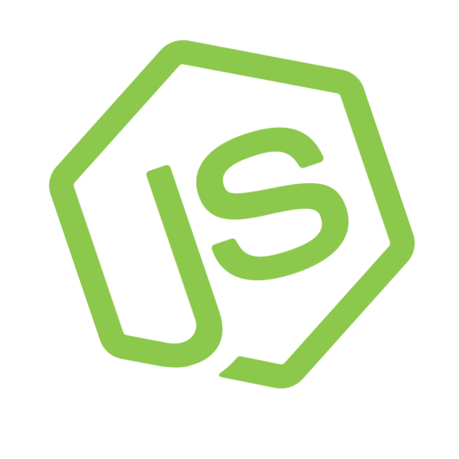
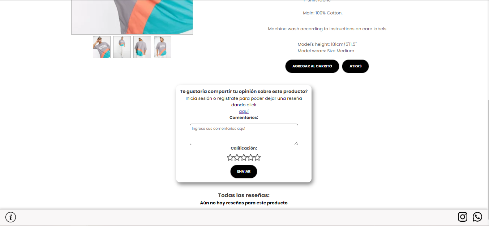

  

   <h1>
     <i>
        
Hola a todos!!  
               Mi nombre es Matías Sebastián Antúnez,  
               Soy Desarrollador Jr. Full Stack 💻⚡
        

    </i>
  </h1>

## ✍ Languages and Tools

| JavaScript | React JS| Redux | Node JS | Express | PostgreSQL | Sequelize | HTML | CSS | Trello | Slack | CorelDraw |

  
    &nbsp;
  
    &nbsp;
  
    &nbsp;
  
    &nbsp;
  
    &nbsp;
  
    &nbsp;
  
    &nbsp;
  
    &nbsp;
  
    &nbsp;
  
    &nbsp;
  
    &nbsp;
  

&nbsp;
&nbsp;

## 📫 How to reach me

    &nbsp;&nbsp;&nbsp;

    &nbsp;&nbsp;&nbsp;

&nbsp;
&nbsp;

<!--
 -->

## 📌 Some screenshots of my proyects:

### FullStack Developer - E-Commerce - Clothes 22 - PI- FOOD!

---

---
